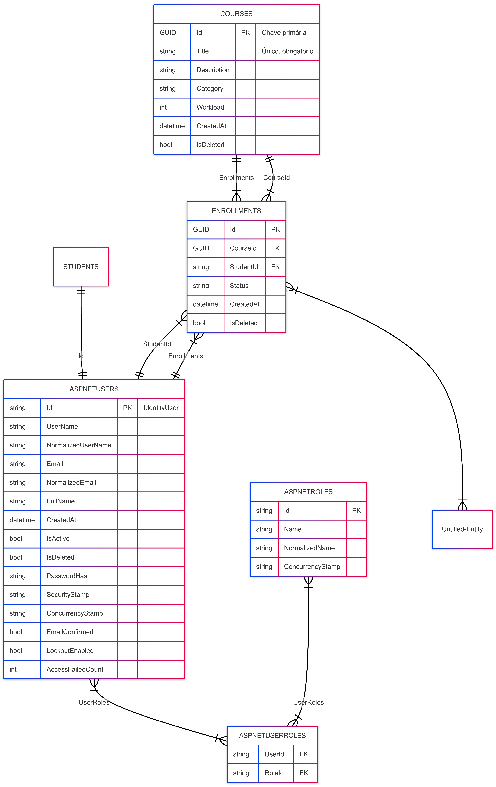

# Plataforma de Cursos - API

## Objetivo
API REST desenvolvida em .NET 8 para gerenciamento de cursos, estudantes e matrículas, com autenticação JWT e controle de acesso por papéis.

## Tecnologias
- .NET 8
- ASP.NET Core Web API
- Entity Framework Core
- ASP.NET Identity
- JWT
- SQLite

## Requisitos
- .NET SDK 8+

## Como Executar

```bash
dotnet restore
dotnet run

Acesse:
https://localhost:7293/swagger

Configurações

As configurações sensíveis são definidas via variáveis de ambiente ou User Secrets.

## Diagrama das Entidades

O diagrama abaixo representa as principais entidades da API de cursos, seus relacionamentos e campos principais:



**Observações:**

- **Students**: cada aluno referencia um usuário do Identity via `UserId`.  
- **Enrollments**: vincula alunos e cursos, com índice único `(StudentId, CourseId)` para evitar duplicação de matrícula.  
- **Soft delete**: implementado em `Courses`, `Students` e `Enrollments` através do campo `IsDeleted`.  
- **CreatedAt**: inicializado automaticamente em todas as entidades do domínio.  
- **AspNetUsers**: mantém autenticação e e-mail único do Identity.

## Diagrama de Entidades (Mermaid)

```mermaid
erDiagram
    COURSES {
        GUID Id PK "Chave primária"
        string Title
        string Description
        string Category
        int Workload
        datetime CreatedAt
        bool IsDeleted
    }
    
    STUDENTS {
        GUID Id PK "Chave primária"
        string FullName
        string UserId FK "FK para AspNetUsers.Id"
        datetime CreatedAt
        bool IsActive
        bool IsDeleted
    }

    ENROLLMENTS {
        GUID Id PK
        GUID CourseId FK
        string StudentId FK
        string Status
        datetime CreatedAt
        bool IsDeleted
    }

    ASPNETUSERS {
        string Id PK
        string Email "Email único"
        string UserName
        string PasswordHash
        ...
    }

    STUDENTS ||--|| ASPNETUSERS : "UserId → Id"
    ENROLLMENTS }|--|| STUDENTS : "StudentId"
    ENROLLMENTS }|--|| COURSES : "CourseId"
    COURSES ||--|{ ENROLLMENTS : "Enrollments"
    STUDENTS ||--|{ ENROLLMENTS : "Enrollments"


